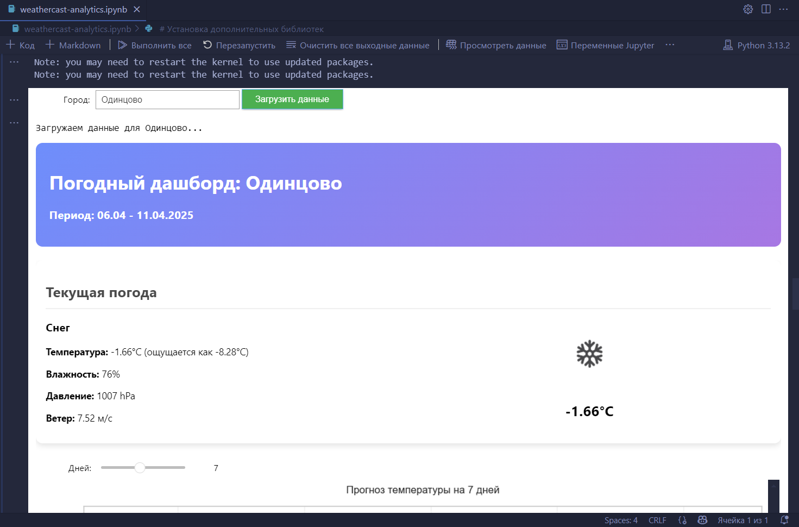
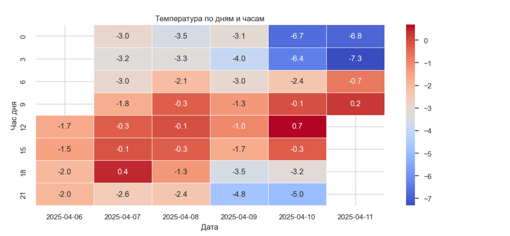
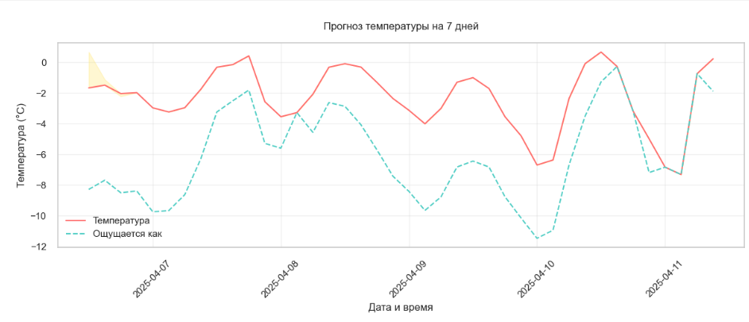
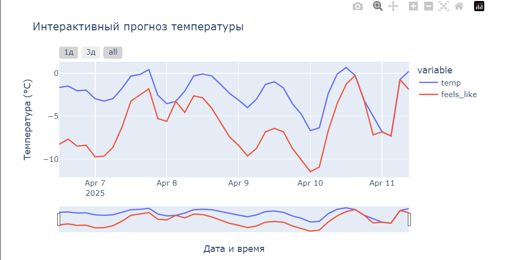
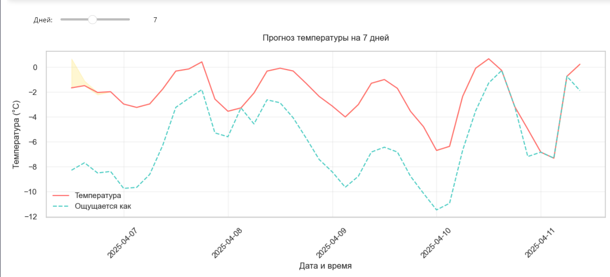

# Weather Analytics Dashboard 🌦️📊

**Название проекта**: `WeatherCast Analytics`











## Описание проекта

`WeatherCast Analytics` — это интерактивный дашборд для визуализации прогноза погоды с использованием данных OpenWeatherMap `API`

**Проект предоставляет:**

- 📈 Графики температуры (линейные, тепловые карты)

- 🌤️ Текущие погодные условия с иконками

- 💨 Анализ ветра, влажности и давления

- 📅 Прогноз на 1-14 дней с возможностью настройки периода

- 📂 Автосохранение всех графиков в папку `img/`

## Функционал

✔️ Загрузка данных для любого города

✔️ **4 типа визуализаций:**

    - Линейный график температуры (Matplotlib)

    - Интерактивный график (Plotly)
    - Тепловая карта по часам (Seaborn)

    - Круговая диаграмма погодных условий

✔️ Слайдер для выбора периода прогноза

✔️ Локальное сохранение графиков и иконок

## Технологии

- `Python 3`
- **Библиотеки:**

    - `requests` (запросы к `API`)
    - `pandas` (обработка данных)
    - `matplotlib/seaborn` (статические графики)
    - `plotly` (интерактивные графики)
    - `ipywidgets` (интерактивные элементы)

- `OpenWeatherMap API`

## Как запустить ?

1. **Установите зависимости:**
   ```bash
   pip install plotly seaborn matplotlib ipywidgets requests pandas
   ```

2. **Запустите Jupyter Notebook или Google Colab:**
   ```python
   dashboard = WeatherDashboard(api_key="ВАШ_API_КЛЮЧ")
   ```

3. Введите город и настройте период анализа.

## Скриншоты

(Примеры графиков из папки `img/`)

`1_temperature_plot.png` — график температуры

`2_heatmap.png` — тепловая карта

`3_weather_pie.png` — распределение погоды

## Лицензия

`MIT License` - открытый код для любых целей.

